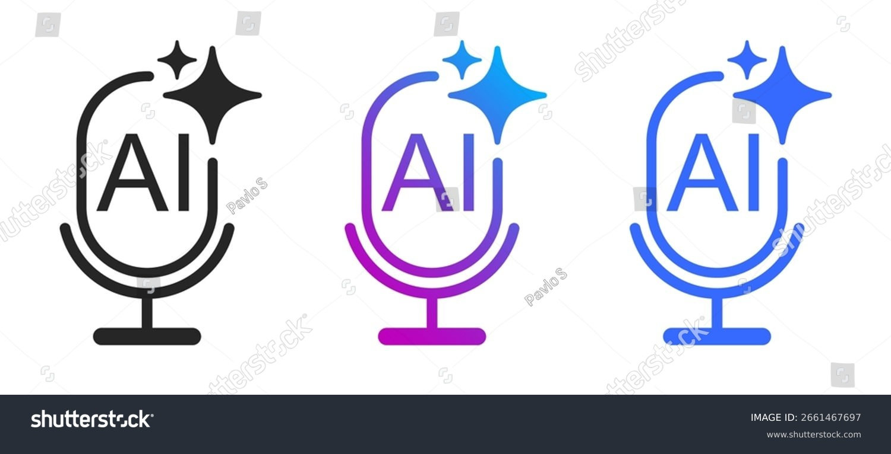

# Assets-Sammlung für Voice Assistant Projekt

## Übersicht

Diese Datei dokumentiert alle visuellen Assets, Icons und Ressourcen für das Computer Voice Assistant Projekt.

---

## Icons & Logos

### 1. Voice Assistant Icons (Flaticon)

**Dateien:**
- `4gRlVK12tORi.png` - Mikrofon mit Soundwellen (grün/grau)
- `Q6i3pgrZwzJG.png` - Mikrofon mit Soundwellen (schwarz)
- `4W9TtynImUmE.png` - Mikrofon mit Soundwellen (rosa/lila)

**Verwendung:**
- Desktop-Icon für Voice Assistant
- GitHub Repository Social Preview
- Dokumentations-Header

**Lizenz:** Free for personal use (Flaticon)

---

### 2. AI Assistant Logos

**Dateien:**
- `cdEAdwWksumG.jpg` - AI Voice Assistant Logo mit Mikrofon und Sparkle
- `MCJWL8XBqml8.jpg` - Virtual Assistant Logo Collection
- `cnNkBkm9rBDK.jpg` - AI Assistant Line Icon

**Verwendung:**
- Präsentationen
- README.md Header
- Marketing-Material

**Lizenz:** Shutterstock (Royalty-Free)

---

### 3. Wake-Word Detection Visualisierungen

**Dateien:**
- `lsIiHrEwj5xw.png` - Wake Word Detector Diagram (Audio Buffer → Spectrum → Learn → Detect)
- `zxqCAE1I8vtD.png` - Wake Word Detection Technical Visualization

**Verwendung:**
- Technische Dokumentation
- Architektur-Diagramme
- Training-Guide Illustrationen

**Quelle:** Rajashekar's Blog on Wake Word Detection

---

## Empfohlene Icon-Nutzung

### Desktop-Icon (Windows)

**Empfehlung:** `4gRlVK12tORi.png` (Mikrofon mit grünen Soundwellen)

**Konvertierung zu .ico:**
```powershell
# Mit Python PIL
from PIL import Image
img = Image.open('4gRlVK12tORi.png')
img.save('voice_assistant.ico', format='ICO', sizes=[(256, 256)])
```

**Integration:**
```python
# In voice_assistant_computer.py
import pystray
from PIL import Image

icon_image = Image.open('voice_assistant.ico')
icon = pystray.Icon("Voice Assistant", icon_image, "Computer Voice Assistant")
```

---

### GitHub Repository Icon

**Empfehlung:** `cdEAdwWksumG.jpg` (AI Voice Assistant Logo)

**Setup:**
1. Gehe zu GitHub Repository Settings
2. Social Preview → Upload image
3. Wähle `cdEAdwWksumG.jpg`
4. Crop zu 1280x640px

---

### README.md Header

**Empfehlung:** Erstelle Banner mit Logo + Titel

```markdown
<div align="center">
  
  <h1>Computer Voice Assistant</h1>
  <p>🎤 Star Trek-inspired wake word detection with LLM integration</p>
</div>
```

---

## Zusätzliche Assets (zu erstellen)

### 1. Demo-Screenshots

**Benötigt:**
- [ ] Terminal-Screenshot mit Wake-Word-Erkennung
- [ ] Windows-Notification bei Aktivierung
- [ ] Picovoice Console Screenshot (Training)
- [ ] Performance-Monitoring Dashboard

**Tool:** Windows Snipping Tool oder ShareX

---

### 2. Demo-Video

**Konzept:**
1. Zeige Desktop
2. Sage "Computer"
3. Voice Assistant reagiert mit "Ja?"
4. Gib Befehl: "Öffne YouTube"
5. Browser öffnet sich
6. Zeige LLM-Integration: "Computer, wie wird das Wetter?"

**Tool:** OBS Studio oder Windows Game Bar (Win+G)

**Länge:** 30-60 Sekunden

**Upload:** YouTube + GitHub README embed

---

### 3. Architektur-Diagramm

**Zu erstellen:**
```
┌─────────────┐
│   Mikrofon  │
└──────┬──────┘
       │
       ▼
┌─────────────────┐
│  Wake-Word      │
│  (Porcupine)    │
└──────┬──────────┘
       │
       ▼
┌─────────────────┐
│  Speech-to-Text │
│  (Vosk)         │
└──────┬──────────┘
       │
       ▼
┌─────────────────┐
│  Classifier     │
└──────┬──────────┘
       │
   ┌───┴───┐
   │       │
   ▼       ▼
┌──────┐ ┌──────┐
│Command│ │ LLM  │
│Engine │ │Router│
└───┬──┘ └───┬──┘
    │        │
    └────┬───┘
         │
         ▼
    ┌─────────┐
    │   TTS   │
    └─────────┘
```

**Tool:** draw.io, Excalidraw oder Mermaid

---

### 4. Logo-Varianten

**Zu erstellen:**
- [ ] Logo mit Projekt-Name
- [ ] Logo in verschiedenen Größen (16x16, 32x32, 64x64, 256x256)
- [ ] Transparenter Hintergrund (.png)
- [ ] Dark Mode Variante
- [ ] Light Mode Variante

**Tool:** Canva, Figma oder GIMP

---

## Branding-Guidelines

### Farben

**Primär-Farben:**
- **Grün:** `#00D9A3` (Mikrofon-Soundwellen)
- **Grau:** `#4A5568` (Mikrofon)
- **Schwarz:** `#1A202C` (Text)

**Sekundär-Farben:**
- **Blau:** `#3B82F6` (Links, Buttons)
- **Lila:** `#8B5CF6` (AI-Elemente)
- **Rosa:** `#EC4899` (Highlights)

### Typografie

**Haupt-Font:** Inter, Roboto oder System-Default
**Code-Font:** Fira Code, JetBrains Mono

### Stil

**Design-Prinzipien:**
- Modern & Minimalistisch
- Tech-orientiert
- Professionell aber zugänglich
- Star Trek-inspiriert (subtil)

---

## Asset-Verzeichnis-Struktur

```
assets/
├── icons/
│   ├── voice_assistant.ico          # Windows Desktop Icon
│   ├── voice_assistant_16.png       # 16x16
│   ├── voice_assistant_32.png       # 32x32
│   ├── voice_assistant_64.png       # 64x64
│   └── voice_assistant_256.png      # 256x256
├── logos/
│   ├── logo_full.png                # Logo mit Text
│   ├── logo_icon.png                # Nur Icon
│   ├── logo_dark.png                # Dark Mode
│   └── logo_light.png               # Light Mode
├── screenshots/
│   ├── demo_wake_word.png           # Wake-Word Demo
│   ├── demo_command.png             # Befehl-Ausführung
│   ├── demo_llm.png                 # LLM-Integration
│   └── picovoice_console.png        # Training-Screenshot
├── diagrams/
│   ├── architecture.png             # System-Architektur
│   ├── llm_flow.png                 # LLM-Integration Flow
│   └── wake_word_detection.png      # Wake-Word Detection
└── videos/
    ├── demo_short.mp4               # 30s Demo
    └── demo_full.mp4                # Vollständige Demo
```

---

## Lizenz-Informationen

### Verwendete Assets

**Flaticon Icons:**
- Lizenz: Free for personal use with attribution
- Attribution: Icons made by Flaticon (https://www.flaticon.com)

**Shutterstock Images:**
- Lizenz: Royalty-Free (falls gekauft)
- Verwendung: Kommerziell erlaubt

**Wake-Word Visualisierungen:**
- Quelle: Rajashekar's Blog
- Lizenz: Educational use (mit Attribution)

### Projekt-eigene Assets

Alle selbst erstellten Assets (Screenshots, Diagramme, Videos) sind unter der **MIT-Lizenz** verfügbar.

---

## Asset-Erstellung Tools

### Kostenlose Tools

**Icons & Logos:**
- Canva (https://www.canva.com) - Grafik-Design
- Figma (https://www.figma.com) - UI/UX Design
- GIMP (https://www.gimp.org) - Bildbearbeitung

**Diagramme:**
- draw.io (https://app.diagrams.net) - Flowcharts
- Excalidraw (https://excalidraw.com) - Hand-drawn Diagrams
- Mermaid (https://mermaid.js.org) - Code-based Diagrams

**Screenshots:**
- ShareX (https://getsharex.com) - Windows Screenshot Tool
- Greenshot (https://getgreenshot.org) - Screenshot + Annotation

**Videos:**
- OBS Studio (https://obsproject.com) - Screen Recording
- DaVinci Resolve (https://www.blackmagicdesign.com) - Video Editing

---

## Nächste Schritte

### Priorität 1 (Sofort)

- [ ] Konvertiere `4gRlVK12tORi.png` zu `.ico` für Desktop-Icon
- [ ] Upload `cdEAdwWksumG.jpg` als GitHub Social Preview
- [ ] Erstelle README.md Header mit Logo

### Priorität 2 (Diese Woche)

- [ ] Erstelle Demo-Screenshots (Terminal, Picovoice Console)
- [ ] Erstelle Architektur-Diagramm
- [ ] Erstelle Logo-Varianten (dark/light mode)

### Priorität 3 (Nächste Woche)

- [ ] Erstelle Demo-Video (30s)
- [ ] Erstelle vollständige Demo-Video (2-3 Minuten)
- [ ] Erstelle Tutorial-Video für Wake-Word Training

---

## Ressourcen-Links

**Icon-Quellen:**
- Flaticon: https://www.flaticon.com/search?word=voice+assistant
- Icons8: https://icons8.com/icons/set/voice-assistant
- Font Awesome: https://fontawesome.com/search?q=microphone

**Inspiration:**
- Alexa Design: https://developer.amazon.com/en-US/alexa/alexa-voice-service
- Google Assistant: https://assistant.google.com
- Siri: https://www.apple.com/siri/

**Tutorials:**
- Icon Design: https://www.youtube.com/results?search_query=icon+design+tutorial
- Logo Design: https://www.youtube.com/results?search_query=logo+design+tutorial

---

**Erstellt:** 05. Dezember 2025  
**Projekt:** Computer Voice Assistant  
**GitHub:** https://github.com/KoMMb0t/Computer-Voice-Assi
